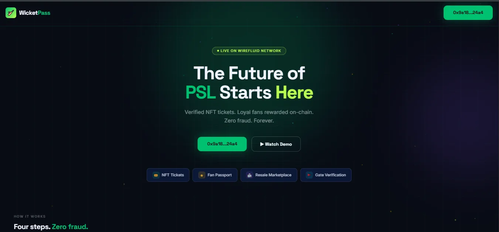
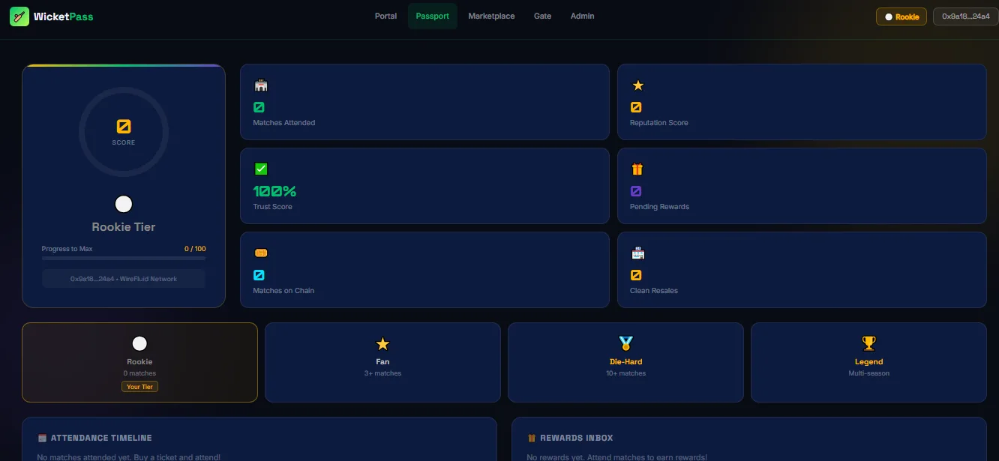
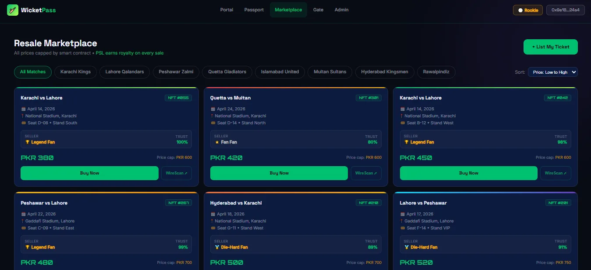
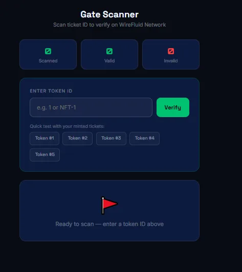
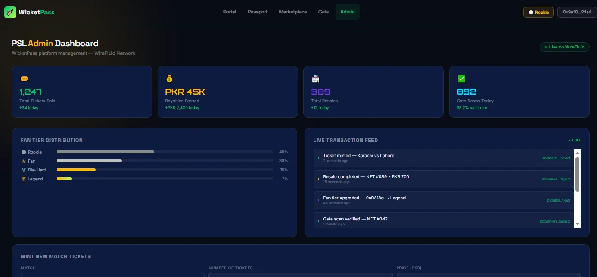

<div align="center">

# WicketPass

**Match tickets that know their fans.**

NFT tickets, an on-chain fan passport and a price-capped resale marketplace for PSL cricket matches.
Your MetaMask wallet is your identity: there is no login screen.

**[Live site](https://wicketpass.vercel.app)** · **[Contracts on WireScan](docs/deployments.md)**



</div>

## Why

Paper and PDF tickets can be copied, resale happens in group chats at any price, and a fan who comes
to every match looks exactly the same as someone who came once. WicketPass tackles all three:

- **Fake tickets:** every ticket is an ERC-721 NFT with exactly one owner, and it can be scanned at the gate only once.
- **Uncapped resale:** the marketplace enforces a price floor and ceiling in the contract, and pays the league a royalty.
- **Loyalty nobody counts:** a Fan Passport records attendance on-chain and moves fans up reputation tiers.

## How it works

1. **Connect** MetaMask. The wallet address is the fan's identity.
2. **Buy** a ticket for a match. It is minted as an NFT straight to the wallet.
3. **Attend.** Gate staff scan the QR code; the contract verifies ownership and marks the ticket used.
4. **Earn.** Each match attended adds reputation to the Fan Passport and unlocks higher tiers and rewards.

## Smart contracts

Solidity 0.8.28 on OpenZeppelin, deployed on the WireFluid network (chain ID 92533).

| Contract | Job | Rules it enforces |
| --- | --- | --- |
| **TicketNFT** | Creates matches, mints tickets, verifies gate scans, pays the league its royalty on resale | No overselling. A ticket can be scanned once. 10% royalty, capped at 20%. A resale cap can never be set below the original price. |
| **FanPassport** | Reputation score, tiers, attendance history, rewards inbox, blacklist | +35 per match attended, +10 per clean resale, −20 per violation. Tiers at 100, 300 and 700 points. Blacklisted wallets stop earning. |
| **Marketplace** | List, delist and buy resale tickets | Only the owner can list. Used tickets can't be listed. Price must sit between half the original price and the cap. Protected against re-entrancy. |

The contracts call each other: the Marketplace asks TicketNFT to move a ticket, and TicketNFT tells
FanPassport when a fan attends or resells. Addresses and transaction hashes are in
[docs/deployments.md](docs/deployments.md).

## Screens

| Fan Passport | Resale marketplace |
| --- | --- |
|  |  |
| **Gate scanner** | **League admin** |
|  |  |

Pages: fan portal (`/portal`), Fan Passport (`/passport`), marketplace (`/marketplace`),
gate verification (`/gate`) and the league admin panel (`/admin`). Admin figures in the screenshots are demo data.

## Tech stack

| Layer | Technology |
| --- | --- |
| Contracts | Solidity 0.8.28, OpenZeppelin, Hardhat, Mocha and Chai |
| Front end | React 19, Vite, React Router, Tailwind CSS, ethers.js v6, Recharts, QR codes |
| Wallet | MetaMask (switches to or adds the WireFluid network automatically) |
| Network | WireFluid (EVM, chain ID 92533), explorer: WireScan |
| Hosting | Vercel |

## Project structure

```
wicketpass/
├── contracts/            Hardhat project
│   ├── contracts/        TicketNFT.sol, FanPassport.sol, Marketplace.sol
│   ├── scripts/          Deployment scripts, one per contract
│   ├── test/             TicketNFT test suite
│   └── deployments/      Deployed addresses
├── frontend/             React app
│   ├── src/pages/        Landing, FanPortal, FanPassport, Marketplace, GateVerification, AdminPanel
│   ├── src/hooks/        useTicketNFT, useFanPassport, useMarketplace, useWallet
│   ├── src/components/   Passport, marketplace, gate, admin and wallet components
│   └── src/contracts/    ABIs and addresses
└── docs/                 Deployments and screenshots
```

## Run it locally

**Contracts**
```bash
cd contracts
npm install
npx hardhat test          # TicketNFT test suite
```
To deploy, copy `.env.example` to `.env`, add `PRIVATE_KEY` and `WIREFLUID_RPC_URL`, then run the scripts in
`scripts/` with `--network wirefluid`.

**Front end**
```bash
cd frontend
npm install
npm run dev               # http://localhost:5173
```
Copy `frontend/.env.example` to `frontend/.env` and fill in the RPC URL and the three contract addresses.

## Author

**Minahil Nadeem** · [Portfolio](https://minahil-nadeem.vercel.app) · [GitHub](https://github.com/minahilnadeem6688) · [LinkedIn](https://www.linkedin.com/in/minahil-nadeem23)

## License

[MIT](LICENSE)
